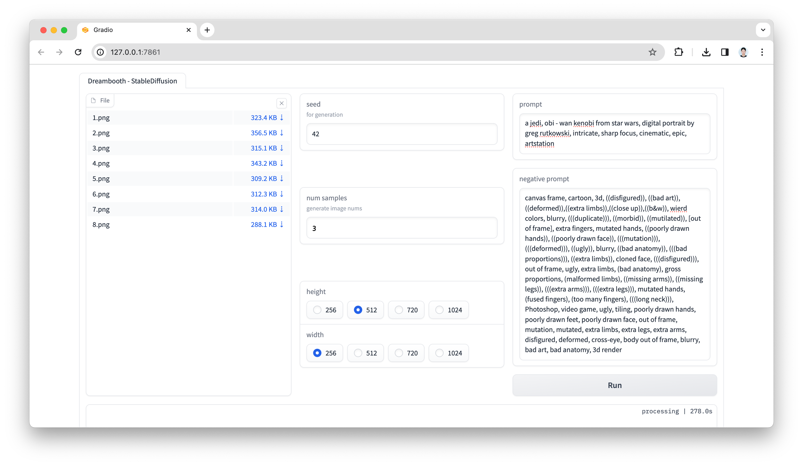

# Dreambooth - StableDiffusion


### data
#### | input


#### | output


### setting

- ```pip install -r requirements.txt```
- set Huggingface token
  - ```mkdir -p ~/.huggingface```
  - ```echo -n "your-token" > ~/.huggingface/token```
  
### structure
```
./
├── data
│   └── person(auto create)
├── tmp(auto create)
│   └── suzy
│       ├── input
│       ├── output
│       ├── ...
│       └── stable_diffusion_weights
├── app.py
├── convert_diffusers_to_original_stable_diffusion.py
└── train_dreambooth.py
```
